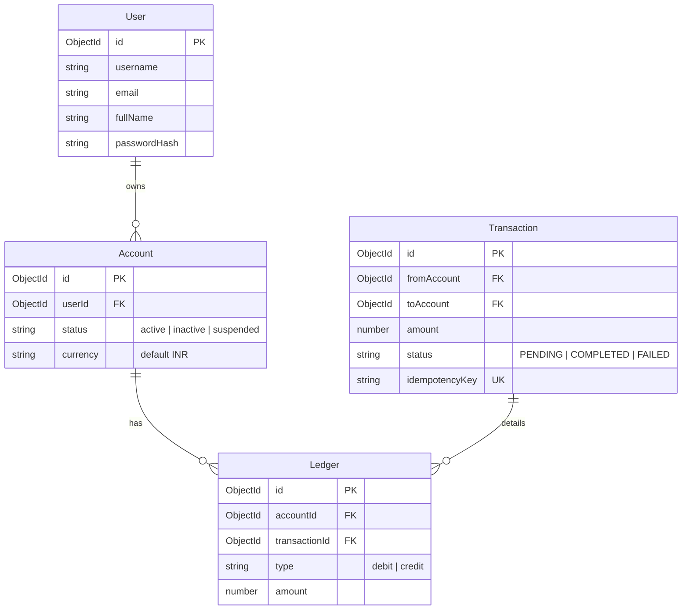

# FinLedger: High-Performance Double-Entry Bookkeeping & Transaction Engine

FinLedger is a production-grade, full-stack financial transaction engine built with a robust double-entry bookkeeping architecture. The system ensures absolute data consistency, ACID compliance, and idempotency, making it suitable for high-throughput fintech applications.

---

##  Architectural Overview & Design Patterns

To meet the rigorous standard of big-tech financial systems, FinLedger implements several key distributed system and database patterns:

```
                  ┌─────────────────────────────────────────┐
                  │               React Client              │
                  └────────────────────┬────────────────────┘
                                       │ (REST API + JWT)
                                       ▼
                  ┌─────────────────────────────────────────┐
                  │            Express API Gateway          │
                  └────────────────────┬────────────────────┘
                                       │
            ┌──────────────────────────┴──────────────────────────┐
            ▼ (Distributed Transaction Session)                   ▼ (Read Path)
┌───────────────────────────────────────┐              ┌───────────────────────────────────────┐
│     Transaction Logging Collection    │              │       Ledger Entries Collection       │
│  - Tracks Intent (PENDING -> COMPLETED)│              │  - Atomic Debits & Credits           │
│  - Idempotency Checks                 │              │  - Aggregated for Balance Derivation  │
└───────────────────────────────────────┘              └───────────────────────────────────────┘
```

### 1. Double-Entry Bookkeeping Ledger
Rather than storing a single mutable "balance" column on the account table (which is prone to race conditions, drift, and lacks auditability), FinLedger uses a immutable ledger pattern:
- **Transactions Collection**: Logs the *intent* and metadata of a transfer between two accounts.
- **Ledger Collection**: Records individual, atomic debit and credit entries. Every successful transfer generates exactly one debit record for the sender and one credit record for the receiver.
- **Derived Balance**: Account balance is computed dynamically by aggregating ledger entries, providing an immutable audit trail.

### 2. ACID Transactions & Database Sessions
To prevent partial execution (e.g., debiting the sender but failing to credit the receiver), the system uses MongoDB multi-document ACID transactions via Mongoose sessions.
- Operations are isolated: `session.startTransaction()` wraps the entire transfer.
- Failure in any step triggers `session.abortTransaction()`, rolling back all changes to preserve consistency.
- Success commits both ledger entries and updates transaction status atomically using `session.commitTransaction()`.

### 3. API Idempotency
To prevent double-spending or duplicate transfers caused by network retries, the system implements an idempotency layer:
- Clients submit a unique `idempotencyKey` with every write.
- The server checks for existing transactions matching the key before executing any logic, returning the cached result if found.

### 4. High-Performance DB-Level Aggregation
Instead of pulling entire transaction histories into application memory (which scales poorly and leaks memory), balances are computed directly in the database engine using an optimized 3-stage aggregation pipeline:
- **`$match`**: Filters ledger records by the specific account ID (backed by a compound index).
- **`$group`**: Groups matching entries and calculates `totalDebit` and `totalCredit` concurrently using conditional sums (`$cond` / `$eq`).
- **`$project`**: Subtracts total debits from total credits on the fly using `$subtract` and returns the final balance.

---

## 🛠️ Technology Stack

- **Backend**: Node.js (ESM), Express.js, MongoDB + Mongoose, JWT (JSON Web Tokens), bcrypt.js, dotenv.
- **Frontend**: React 19, Vite, Lucide React, Custom CSS (Glassmorphism & Sleek Dark UI).

---

##  Database Schema Design



---

## 🚀 API Endpoint Specification

### Authentication
| Method | Endpoint | Description | Auth Required |
| :--- | :--- | :--- | :--- |
| `POST` | `/api/v1/users/register` | Register a new user account | No |
| `POST` | `/api/v1/users/login` | Login user and issue JWT cookie | No |
| `POST` | `/api/v1/users/logout` | Invalidate cookie and logout | Yes |

### Accounts
| Method | Endpoint | Description | Auth Required |
| :--- | :--- | :--- | :--- |
| `POST` | `/api/v1/accounts/create` | Create a new sub-account | Yes |
| `GET` | `/api/v1/accounts/my` | Get all accounts owned by the user | Yes |
| `GET` | `/api/v1/accounts/balance/:accountId` | Retrieve aggregated real-time balance | Yes |

### Transactions & Ledger
| Method | Endpoint | Description | Auth Required |
| :--- | :--- | :--- | :--- |
| `POST` | `/api/v1/transactions/intialFunds` | Deposit mock initial funds into account | Yes |
| `POST` | `/api/v1/transactions/fundsTransfer` | Perform atomic peer-to-peer transfer | Yes |
| `GET` | `/api/v1/transactions/ledger` | Get detailed audit ledger of transactions | Yes |

---

## 💻 Getting Started

### Prerequisites
- Node.js (v18+)
- MongoDB Atlas cluster or local MongoDB instance (configured as a replica set to enable ACID sessions)

### Environment Setup
Create a `.env` file in the `backend/` directory:
```env
PORT=8000
MONGODB_URI=your_mongodb_connection_string
CORS_ORIGIN=http://localhost:5173
ACCESS_TOKEN_SECRET=your_jwt_secret
ACCESS_TOKEN_EXPIRY=1d
REFRESH_TOKEN_SECRET=your_refresh_secret
REFRESH_TOKEN_EXPIRY=10d
```

### Installation

1. **Clone the repository**:
   ```bash
   git clone <repo-url>
   cd BACKEND_SOCIAL
   ```

2. **Start Backend**:
   ```bash
   cd backend
   npm install
   npm run dev
   ```

3. **Start Frontend**:
   ```bash
   cd ../frontend
   npm install
   npm run dev
   ```

---

## 📈 Scalability & Production-Ready Enhancements
If deploying this system to handle millions of transactions daily, the following architecture patterns should be introduced:
1. **Redis Cache for Idempotency**: Offload idempotency validation from MongoDB to a fast in-memory Redis store with an expiration TTL (e.g., 24 hours).
2. **Read-Heavy Caching**: Cache account balances in Redis and update them on write events, using the database aggregation pipeline as the source-of-truth fallback.
3. **Database Sharding**: Partition the `ledger` collection by `accountId` to distribute write throughput across multiple database instances.
4. **Message Queue Integration (RabbitMQ/Kafka)**: Shift transaction handling to an event-driven flow, placing transfer payloads on a queue to guarantee processing under high load spikes.
